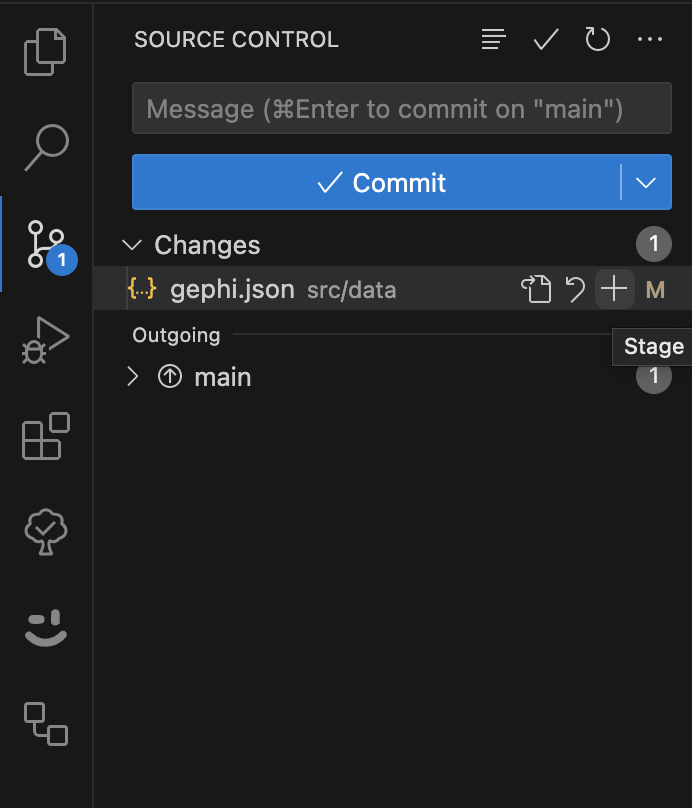

# embodimentdesign

[Vue.js](https://vuejs.org/) + [Vuetify](https://vuetifyjs.com/en/) based application to display a graph containing informations regarding papers that are connected with eachother.
The papers are provided in a `json` format in [src/data/gephi.json](https://github.com/Bananenbrottod/embodimentdesign/blob/main/src/data/gephi.json). This file can be generated by using the `SigmaJS exporter` plugin for Gephi.

## Prerequisites

Please make sure you have installed all the software mentioned below:

### 1. [Gephi](https://gephi.org/)

### 2. Gephi plugins 

[Where to install plugins](https://raw.githubusercontent.com/mizvol/gephi-tutorials/master/SigmaJS%20exporter/images/Plugins.png)

Required plugins:
- Multigravity Force Atlas 2
- Circle Pack
- Label Adjust
- SigmaJS exporter.

### 3. [Git](https://git-scm.com/downloads)

*[What is Git?](https://git-scm.com/book/en/v2/Getting-Started-What-is-Git%3F)*

tl;dr: Git is a distributed version control system (DVCS) designed to handle everything from small to very large projects with speed and efficiency.

When using git for the first time you need configure your identity ohterwise there will be an error message as soon as you try to add a new change. The error message will be
  ```sh
  Unable to obtain your identity:
  Please tell me who you are. Run git config --global user.email "you@example.com"
  git config --global user.name "Your Name" to set your account's default identity.
  ```
  As the error suggests you have to run the following 2 commands in a terminal:
  ```sh
  git config --global user.email "you@example.com"
  git config --global user.name "Your Name"
  ```
  *NOTE:* For more information take a look at the official [configure git](https://git-scm.com/book/en/v2/Getting-Started-First-Time-Git-Setup) documentation

### 4. [Node.js](https://nodejs.org/en/learn/getting-started/how-to-install-nodejs) 

Node.js allows us to run JavaScript code on local machine

Test the installation by opening a terminal and run
 ```sh
 node --version
 ```
 If you see an error message you might have to [add Node.js to your PATH variable](https://codeforgeek.com/adding-nodejs-to-system-path/) then re-open the terminal and try again

### 5. [VSCode](https://code.visualstudio.com/)
The Integrated development environment that will be used to maintain the project

### 6. Recommended VSCode extensions

[How to install extensions](https://code.visualstudio.com/docs/editor/extension-marketplace)

Required extensions:
- [Volar](https://marketplace.visualstudio.com/items?itemName=Vue.volar) ([and disable Vetur](https://stackoverflow.com/questions/64901658/how-do-i-disable-vetur-linting-in-vscode-workspace)) - allows interpretation of .vue files
- [TypeScript Vue Plugin (Volar)](https://marketplace.visualstudio.com/items?itemName=Vue.vscode-typescript-vue-plugin) - allows TypeScript code to be interpreted in .vue files

## First time Setup on local Machine

*NOTE: this has to be done once!*

### 1. Open `VSCode`

You should see the `Welcome` page of VSCode, if not press `CTRL + SHIFT + P` and enter `Help: Welcome`


### 2. Clone the repository 

Choose `Clone Git Repository..`


Then a prompt will open at the top of the screen, enter URL to this repository: `https://github.com/Bananenbrottod/embodimentdesign.git` and confirm.


Then choose a folder where the project shall be saved to.

## Start the Project on local Machine

1. If not done already, open `VSCode` and the folder where the project was cloned to
2. Sync changes from GitHub by pressing `CTRL + SHIFT + P` and entering `Git: Sync`
3. [Open the VSCode integrated terminal](https://code.visualstudio.com/docs/terminal/basics)
4. Run `npm install`
   - [Error: npm command not found](https://phoenixnap.com/kb/npm-command-not-found)
   - Error: no such file `package.json` -> check if you are in the correct folder with the terminal by running `pwd` - you have to be in the root folder of the project
5. Run `npm run dev`

This will start the application in a development setting and provide a link in the terminal that can be opened with `CTRL + CLICK`. Now you can test the application, make changes and they will be reflected in the given browser page.

## Updating the Data (gephi.json)

### 1. Export the data from Gephi

1. Open Gephi
2. File -> Export -> SigmaJS template
3. Fill in all required fields see [tutorial](https://blog.miz.space/tutorial/2020/01/05/gephi-tutorial-sigma-js-plugin-publishing-interactive-graph-online/)


### 2. Replace the old data file

When the export is finished a folder containing a `data.json` should be generated, this file shall be renamed to `gephi.json` and can then be used to replace the old [src/data/gephi.json](https://github.com/Bananenbrottod/embodimentdesign/blob/main/src/data/gephi.json).

This can be done by either deleting the old file and then copying the new one or opening the old file and pasting the content of the new file into it.

You can check if the data is correct by looking in the browser at the application that you've started by following the topic `Start the Project on local Machine`, check if the graph is displayed correctly.

*NOTE:* If you've closed the browser tab you can open the application by following this [link](http://localhost:5174)

### 3. Commit changes to GitHub

When you've replaced the data with the new data you have to stage it in the `Source Control` tab in VSCode. There you simply press the `+` button next to the file `gephi.json`



Then create a `commit` by adding a message and pressing `Commit`


Afterwards sync it with GitHub by pressing `Sync changes`


## Build application and push to gh-pages

To update the application that is running on gh-pages and is implemented on the KIT website.

Execute `deploy` script that is defined in the [package.json](https://github.com/Bananenbrottod/embodimentdesign/blob/main/package.json) by running the following command in the terminal:

````sh
npm run deploy
````

## General Project Structure

### /dist

This is generated by running `npm run build` and holds the compiled and type-checked application for production usage.

### /node_modules

This is generated by running `npm install` and contains all needed node-modules for this project.

### /public

Holds the favicon.ico and other (image) files that should be loaded immediatly.

### /src

Holds the source files for the Vue.js project. 
- main.ts -> script that sets up and mounts the Vue.js application 
- App.vue -> initial view that defines the layout of the application
- /assets
    - Holds the assets of the project. Here custom styles, pictures, fonts and more can be stored.
- /components
    - Here will be all of the custom components that are needed for the application.
- /data
    - Here the gephi.json file is placed which defines the nodes and edges. This is generated by the `SigmaJS exporter` Gephi plugin.
    *See [tutorial](https://blog.miz.space/tutorial/2020/01/05/gephi-tutorial-sigma-js-plugin-publishing-interactive-graph-online/) to export the data from Gephi*
- /plugins 
    - Holds the plugins that are used by the Vue.js application. The index.ts exports a function 'usePlugins' which registers all needed plugins to a given Vue.js App.
- /router
    - Contains the router configuration if the application has multiple (sub)pages.
- /views
    - Contains views that consist of multiple components.
